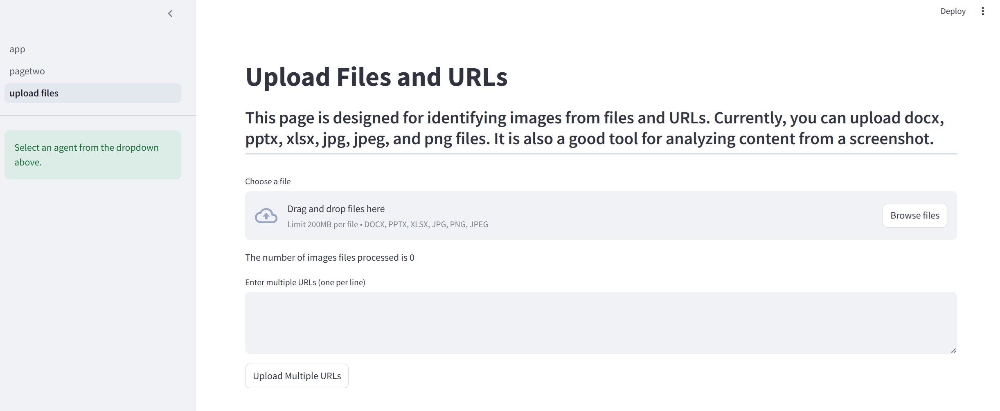

# Agents


## image_extractor_from_files  

This agent can extract images from the following files:
- Microsoft Office files
    - Microsoft Word (docx)  
    - Microsoft Excel (xlsx)
    - Microsoft PowerPoint (pptx)   

- Images
    - png
    - jpeg
    - jpg

- PDFs
    - coming soon


### How to use the agent  
- the agent works from command line where you call the agent and pass in the path of the file or the URL
- swagger document
- Streamlit app


#### Locally from command prompt

If all you want to do is pass in a file and process it you can run the python script from the command line with the following commands  
1. Using a URL file
```plaintext
python -m backend.agents.image_extractor_from_files https://raw.githubusercontent.com/Coding-Forge/Fabric/main/images/admin-portal-settings.png
```
2. passing in a local file from the root folder
```plaintext
python -m backend.agents.image_extractor_from_files ./files/myworddoc.docx
```

#### Using Swagger (fastAPI)

from the command line type the following
```plaintext
fastapi dev backend/app.py
```
This will start the hosting session for the backend server

Open a browser and navigate to 127.0.0.1:8000/docs. You will see a swagger doc where you can try out the APIs

#### Debugging the application  
change directory to backend and open the app.py file  
at this point you can click the debug icon from the vscode side panel  

#### Using Docker containers  

A Docker-compose file has been created to allow for fast build and deployment of the application. From the root folder of your code type the following:

**Linux or Mac** 
```plaintext
sudo docker compose -f "docker-compose.yaml" up -d --build
```

You can then open a browser and navigate to 127.0.0.1:8000/docs 

#### Using Streamlit  
You can run this demonstration by starting up a the streamlit service as the frontside application to connect to the backend service. To start the fastAPI service please see the instructions for [Using Swagger](#using-swagger-fastapi). If using vs code or other ide, open another terminal and on the command line at the root of the application, type the following:
```plaintext
streamlit run frontend/app.py
```

The frontside application should start running. You may get a message stating the ip address of the the frontside application. It will probably start off at `localhost:8501` but be aware that it may be a different port. Once running you can pick the `upload files` on the side bar. You will now have the option to either upload local/network share documents or type in any image URL. See the following below
### File Upload Demo


### Python packages
you can create a virtual environment and install packages from the `requirements.txt` file or if using conda you can create an environment using the `environment.yaml` file

### .env File  
There is a .env.example file with the environment variables that need to be provided. You can set the model and api in the code  


